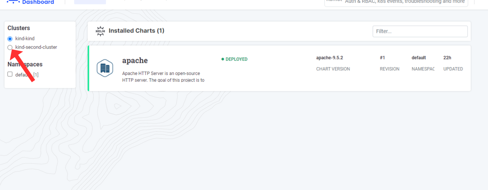

# Shutting down the app
To close Helm-dashboard, click on the button in the rightmost corner of the screen. Once you click on it, your Helm-dashboard will be shut down.

# Multicluster
If you want to switch to a different cluster, simply click on the corresponding cluster as shown in the figure.

