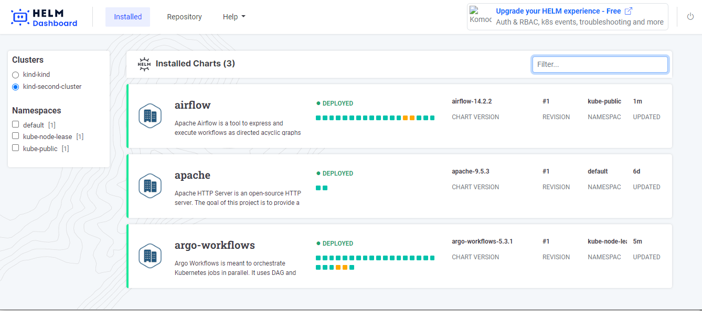
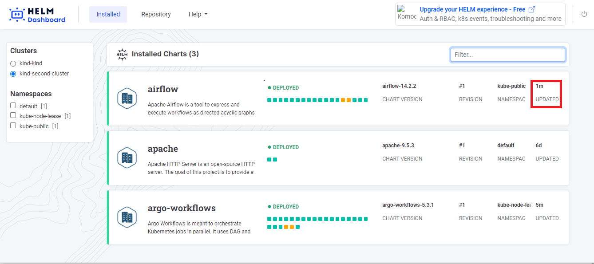

# Helm Dashboard Features Overview

## General Layout and Navigation

### Shutting down the app

If you run the tool locally, you can shutdown the running process. This is useful when you can't find the console where
you started it, or when it was started without console.

To close Helm-dashboard, click on the button in the rightmost corner of the screen. Once you click on it, your
Helm-dashboard will be shut down.


## Releases Management Section

### Switching Clusters

When started as local binary, the tool reads the list of available cluster connections from kubectl config file. Those
connections are displayed on the left side of the screen.


If you want to switch to a different cluster, simply click on the corresponding cluster as shown in the
figure. You
can [read here](https://kubernetes.io/docs/tasks/access-application-cluster/configure-access-multiple-clusters/) to
learn on how to configure access to multiple clusters.

## Installed Releases List

A release is an installation of your Helm chart deployed in your Kubernetes Cluster. That means every time that you
install or upgrade a Helm chart, it creates a new release revision that coexists with other releases. You
can filter releases based on namespaces or search for release names


The squares represent k8s resources installed by the release. Hover over each square to view a tooltip with details.
Yellow indicates "pending," green signifies a healthy state, and red indicates an unhealthy state.


It indicates the version of chart that corresponds to this release.


A revision is linked to a release to track the number of updates/changes that release encounters.


Namespaces are a way to organize clusters into virtual sub-clusters — they can be helpful when different teams or
projects share a Kubernetes cluster. Any number of namespaces are supported within a cluster, each logically separated
from others but with the ability to communicate with each other.


Updated" refers to the amount of time that has passed since the last revision of the release. Whenever you install or
upgrade the release, a new revision is created. You can think of it as the "age" of the latest revision.


## Release details

This indicates the status of the deployed release, and 'Age' represents the amount of time that has passed since the
creation of the revision until now.


You can use the Upgrade/Downgrade button to switch to different release versions, as shown in the figure.


### Execute Helm tests

For all the release(s) (installed helm charts), you can execute helm tests for that release. For the tests to execute
successfully, you need to have existing tests for that helm chart.

You can execute `helm test` for the specific release as below:


The result of executed `helm test` for the release will be displayed as below:


### Scanner Integrations

Upon startup, Helm Dashboard detects the presence of [Trivy](https://github.com/aquasecurity/trivy)
and [Checkov](https://github.com/bridgecrewio/checkov) scanners. When available, these scanners are offered on k8s
resources page, as well as install/upgrade preview page.

You can request scanning of the specific k8s resource in your cluster:


If you want to validate the k8s manifest prior to installing/reconfiguring a Helm chart, look for "Scan for Problems"
button at the bottom of the dialog:


## Repository Section

Essentially, a repository is a location where charts are gathered and can be shared over network. If you want to learn
more about Helm chart
repositories, [click here](https://helm.sh/docs/topics/chart_repository/).

You can access the repository management area of Helm Dashboard in the main navigation section, as depicted in the
figure.


You can add the repository by clicking on 'Add Repository' button on the left, as shown in the figure.


After completing that step, enter the following data: the repository name and its URL. You can also add the username and
password, although this is optional.


Updating means refreshing your repository. You can update your repository as shown in the figure.


If you want to remove your repository from the Helm dashboard, click on the 'Remove' button as shown in the figure.


Use the filter option to find the desired chart quicker from the list of charts.


If you want to install a particular chart, simply hover the pointer over the chart name and an 'Install' button will
appear, as shown in the figure.


# Support for Local Charts

Local Helm chart is a directory with specially named files and a `Chart.yaml` file, which you can install via Helm,
without the need to publish the chart into Helm repository. Chart developers might want to experiment with the chart
locally, before uploading into public repository. Also, a proprietary application might only use non-published chart as
an approach to deploy the software.

For all the above use-cases, you may use Helm Dashboard UI, specifying the location of your local chart folders via
special `--local-chart` command-line parameter. The parameter might be specified multiple times, for example:

```shell
helm-dashboard --local-chart=/opt/charts/my-private-app --local-chart=/home/dev/sources/app/chart
```

When _valid_ local chart sources specified, the repository list would contain a surrogate `[local]` entry, with those
charts listed inside. All the chart operations are normal: installing, reconfiguring and upgrading.


