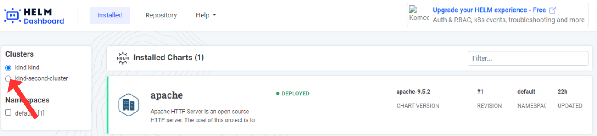
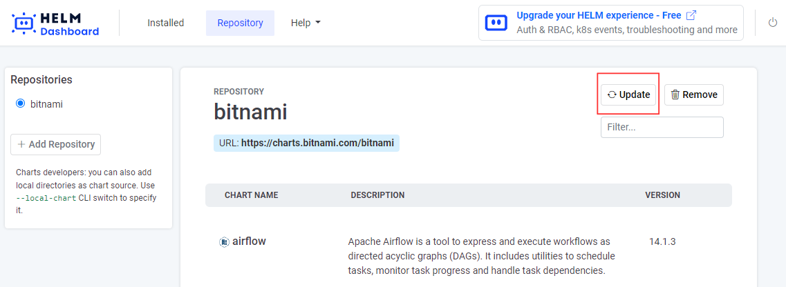

# Shutting down the app
To close Helm-dashboard, click on the button in the rightmost corner of the screen. Once you click on it, your Helm-dashboard will be shut down.

# Multicluster
If you want to switch to a different cluster, simply click on the corresponding cluster as shown in the figure. [Click here](https://kubernetes.io/docs/tasks/access-application-cluster/configure-access-multiple-clusters/) to learn how to access multiple clusters.

# Repository
Essentially, a repository is a location where charts are gathered and can be shared. If you want to learn more about repositories, [click here](https://helm.sh/docs/topics/chart_repository/). You can find the repository in the home section, as depicted in the figure.

You can add the repository by clicking on 'Add Repository', as shown in the figure.

After completing that step, enter the following data: the repository name and its URL. You can also add the username and password, although this is optional.

Updating means refreshing your repository. You can update your repository as shown in the figure.

If you want to remove your repository from the Helm dashboard, click on the 'Remove' button as shown in the figure.

Use the filter option to find the desired chart quicker from the list of charts.
