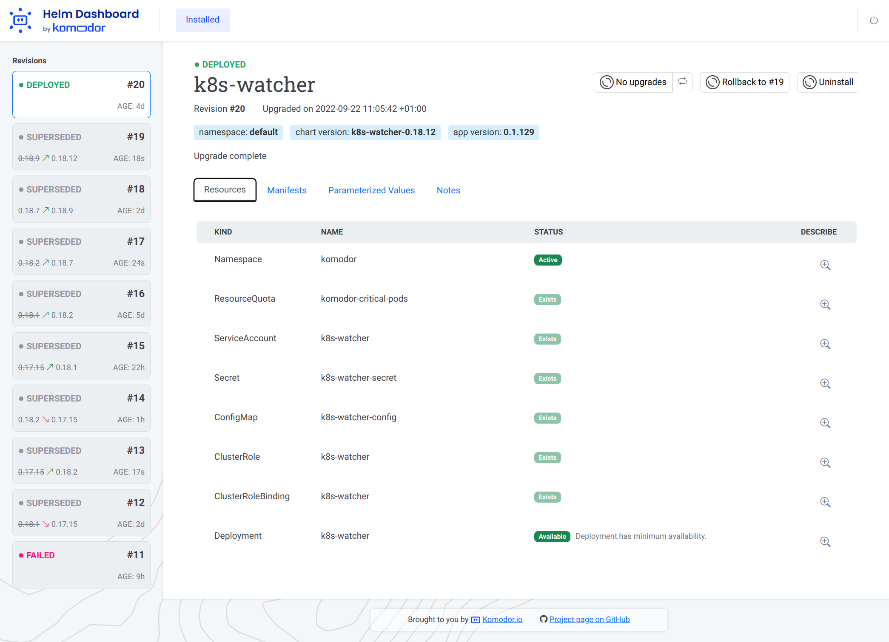
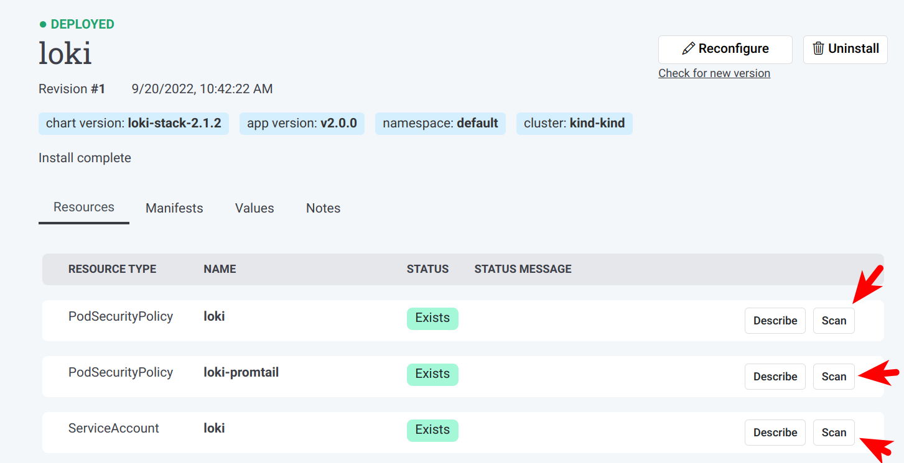
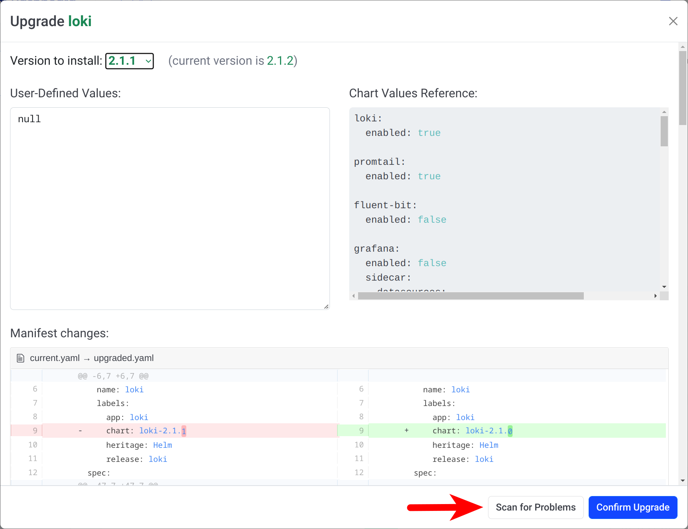

# 

A simplified way of working with Helm.

<kbd>[](screenshot.png)</kbd>

## What it Does?

The _Helm Dashboard_ plugin offers a UI-driven way to view the installed Helm charts, see their revision history and
corresponding k8s resources. Also, you can perform simple actions like roll back to a revision or upgrade to newer
version.

This project is part of [Komodor's](https://komodor.com/?utm_campaign=Helm-Dash&utm_source=helm-dash-gh) vision of
helping Kubernetes users to navigate and troubleshoot their clusters.

Some of the key capabilities of the tool:

- See all installed charts and their revision history
- See manifest diff of the past revisions
- Browse k8s resources resulting from the chart
- Easy rollback or upgrade version with a clear and easy manifest diff
- Integration with popular problem scanners
- Easy switch between multiple clusters

## Installing

To install it, simply run Helm command:

```shell
helm plugin install https://github.com/komodorio/helm-dashboard.git
```

To update the plugin to the latest version, run:

```shell
helm plugin update dashboard
```

To uninstall, run:

```shell
helm plugin uninstall dashboard
```

Note: In case standard Helm plugin way did not work for you, you can just download the appropriate [release package](https://github.com/komodorio/helm-dashboard/releases) for your platform, unpack it and just run `dashboard` binary from it.

## Running

To use the plugin, your machine needs to have working `helm` and also `kubectl` commands. Helm version 3.4.0+ is required.

After installing, start the UI by running:

```shell
helm dashboard
```

The command above will launch the local Web server and will open the UI in new browser tab. The command will hang
waiting for you to terminate it in command-line or web UI.

You can see the list of available command-line flags by running `helm dashboard --help`.

By default, the web server is only available locally. You can change that by specifying `HD_BIND` environment variable
to the desired value. For example, `0.0.0.0` would bind to all IPv4 addresses or `[::0]` would be all IPv6 addresses.

If your port 8080 is busy, you can specify a different port to use via `--port <number>` command-line flag.

If you need to limit the operations to a specific namespace, please use `--namespace=...` in your command-line. 

If you don't want browser tab to automatically open, add `--no-browser` flag in your command line.

If you want to increase the logging verbosity and see all the debug info, use the `--verbose` flag.

## Scanner Integrations

Upon startup, Helm Dashboard detects the presence of [Trivy](https://github.com/aquasecurity/trivy)
and [Checkov](https://github.com/bridgecrewio/checkov) scanners. When available, these scanners are offered on k8s
resources page, as well as install/upgrade preview page.

You can request scanning of the specific k8s resource in your cluster:


If you want to validate the k8s manifest prior to installing/reconfiguring a Helm chart, look for "Scan for Problems"
button at the bottom of the dialog:


## Support Channels

We have two main channels for supporting the Helm Dashboard
users: [Slack community](https://join.slack.com/t/komodorkommunity/shared_invite/zt-1dm3cnkue-ov1Yh~_95teA35QNx5yuMg) for general conversations
and [GitHub issues](https://github.com/komodorio/helm-dashboard/issues) for real bugs.


## Local Dev Testing

Prerequisites: `helm` and `kubectl` binaries installed and operational.

There is a need to build binary for plugin to function, run:

```shell
go build -o bin/dashboard .
```

You can just run the `bin/dashboard` binary directly, it will just work.

To install, checkout the source code and run from source dir:

```shell
helm plugin install .
```

Local installation of plugin just creates a symlink, so making the changes and rebuilding the binary would not require
to
reinstall a plugin.

To use the plugin, run in your terminal:

```shell
helm dashboard
```

Then, use the web UI.
