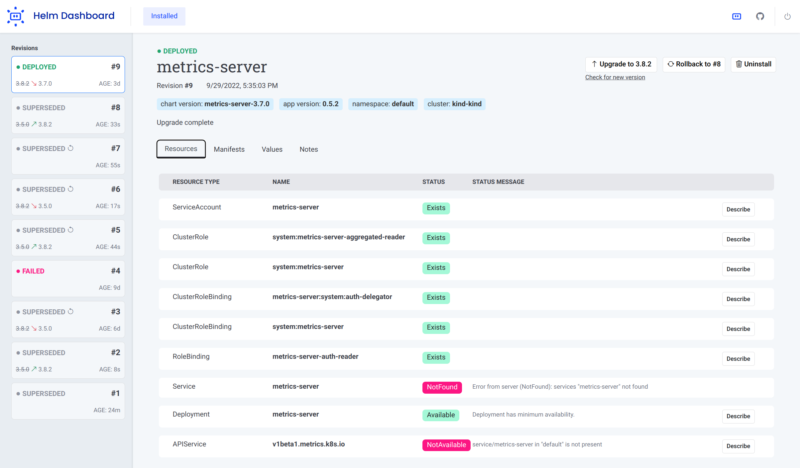

<p align="center">
  <picture>
    <source media="(prefers-color-scheme: dark)" srcset="images/logo-header-inverted.svg">
    <source media="(prefers-color-scheme: light)" srcset="images/logo-header.svg#gh-light-mode-only">
    
  </picture>
</p>

<p align="center">A simplified way of working with Helm.</p>

 [](https://github.com/komodorio/helm-dashboard/issues)    [](https://github.com/komodorio/helm-dashboard/releases)  [](https://github.com/komodorio/helm-dashboard) [](https://codecov.io/gh/komodorio/helm-dashboard)

<kbd>[](images/screenshot.png)</kbd>

## Description

_Helm Dashboard_ is an **open-source project** which offers a UI-driven way to view the installed Helm charts, see their revision history and
corresponding k8s resources. It also allows users to perform simple actions such as rolling back to a
revision or upgrading to a newer version.
This project is part of [Komodor's](https://komodor.com/?utm_campaign=Helm-Dash&utm_source=helm-dash-gh) vision to
help Kubernetes users to navigate and troubleshoot their clusters. It is important to note that Helm Dashboard is **NOT** an official project by the [helm team](https://helm.sh/).

Key capabilities of the tool:

- See all installed charts and their revision history
- See manifest diff of the past revisions
- Browse k8s resources resulting from the chart
- Easy rollback or upgrade version with a clear and easy manifest diff
- Integration with popular problem scanners
- Easy switch between multiple clusters
- Can be used locally, or installed into Kubernetes cluster
- Does not require Helm or Kubectl installed

All the features of the tool can be discovered via our [features overview page](FEATURES.md).

## Installation

### Standalone Binary

Since version 1.0, the recommended install method is to just use standalone binary. It does not require Helm or kubectl to be installed.

Download the appropriate [release package](https://github.com/komodorio/helm-dashboard/releases) for your platform, unpack it and just run `dashboard` binary from it. See below section for some more CLI parameters to use.

### Using Helm plugin manager

To install dashboard as Helm plugin, simply run Helm command:

```shell
helm plugin install https://github.com/komodorio/helm-dashboard.git
```

To update the plugin to the latest version, run:

```shell
helm plugin update dashboard
```

To uninstall, run:

```shell
helm plugin uninstall dashboard
```

To use the plugin, your machine needs to have working `helm` and also `kubectl` commands. Helm version 3.4.0+ is required.

After installing, start the UI by running:

```shell
helm dashboard
```

The command above will launch the local Web server and will open the UI in a new browser tab. The command will hang
waiting for you to terminate it in command-line or web UI.

You can see the list of available command-line flags by running `helm dashboard --help`.

By default, the web server is only available locally. You can change that by specifying `HD_BIND` environment variable
to the desired value. For example, `0.0.0.0` would bind to all IPv4 addresses or `[::0]` would be all IPv6 addresses.
This can also be specified using flag `--bind <host>`, for example `--bind=0.0.0.0` or `--bind 0.0.0.0`.

> Precedence order: flag `--bind=<host>` > env `HD_BIND=<host>` > default value `localhost`

If your port 8080 is busy, you can specify a different port to use via `--port <number>` command-line flag.

If you need to limit the operations to a specific namespace, please use `--namespace=...` in your command-line. You can specify multiple namespaces, separated by commas.

If you don't want the browser tab to automatically open, add `--no-browser` flag in your command line.

If you want to increase the logging verbosity and see all the debug info, use the `--verbose` flag.

> Disclaimer: For the sake of improving the project quality, there is user analytics collected by the tool. You can disable this collecting with `--no-analytics` option. The collection is done via DataDog RUM and Heap Analytics. Only the anonymous data is collected, no sensitive information is used.

### Deploying Helm Dashboard on Kubernetes

The official helm chart is [available here](https://github.com/komodorio/helm-charts/blob/master/charts/helm-dashboard)

## Support Channels

We have two main channels for supporting the Helm Dashboard
users: [Slack community](https://komodorkommunity.slack.com) for general conversations
and [GitHub issues](https://github.com/komodorio/helm-dashboard/issues) for real bugs.

## Contributing

Kindly read our [Contributing Guide](CONTRIBUTING.md) to learn and understand about our development process, how to propose bug fixes and improvements, and how to build and test your changes to Helm Dashboard. <br>

## Contributors

<a href="https://github.com/komodorio/helm-dashboard/graphs/contributors">
  
</a>

## Local Dev Testing

Prerequisites, binaries installed and operational:

- [Golang](https://go.dev/doc/install)
- Node.js

There is a need to build frontend and then backend as a series of commands, run:

### Linux

```shell
cd frontend && npm run build && cd ..
go build -o bin/dashboard .
```

Or just `make build` that will do everything inside.

Then, you can run `npm run dev` from `frontend` directory to work on frontend with Vite hot reload.

### Windows

```bat
cd frontend && npm run build && cd ..
go build -o bin\dashboard.exe .
```

You can just run the `dashboard` or `dashboard.exe` binary directly.

To install, checkout the source code and run from source dir:

```shell
helm plugin install .
```

A local installation of the plugin just creates a symlink, so making the changes and rebuilding the binary would not require
to
reinstall a plugin.

To use the plugin, run in your terminal:

```shell
helm dashboard
```

Then, use the web UI.

## Development Snapshots

In our GitHub actions, we attach the built binaries as build artifacts, you can download and test it fully assembled.

Also, we upload `unstable` tag for Docker image upon every build of `main` branch, you can make our Helm chart to use that image by providing values:

```yaml
image:
  pullPolicy: Always
  tag: unstable
```
