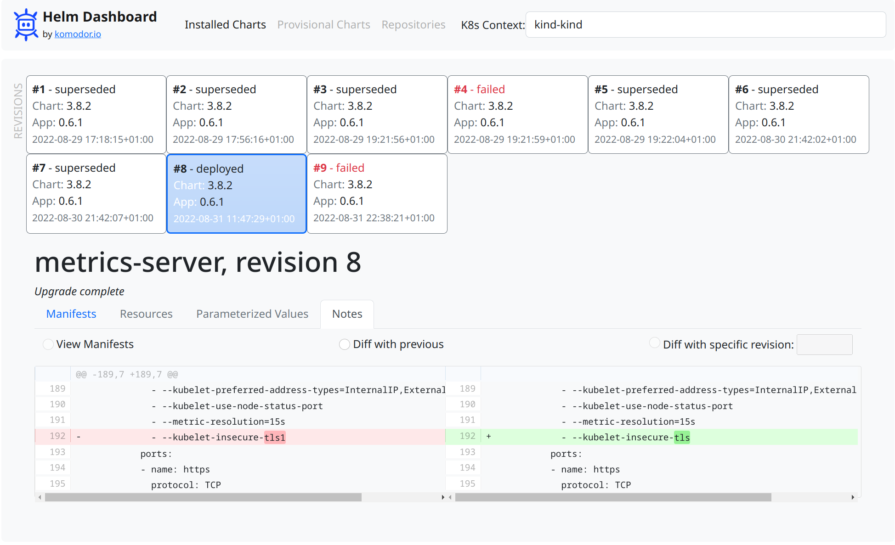

#  Helm Dashboard

A simplified way of working with Helm.

[](screenshot.png)

## Local Testing

Prerequisites: `helm` and `kubectl` binaries installed and operational.

Until we make our repo public, we have to use a custom way to install the plugin.

There is a need to build binary for plugin to function, run:
```shell
go build -o bin/dashboard .
```

To install, checkout the source code and run from source dir:
```shell
helm plugin install .
```

Local install of plugin just creates a symlink, so making the changes and rebuilding the binary would not require to reinstall a plugin.

To use the plugin, run in your terminal:
```shell
helm dashboard
```

Then, use the web UI. 

## Uninstalling

To uninstall, run:
```shell
helm plugin uninstall dashboard
```

## Support Channels

We have two main channels for supporting the tool users: [Slack community](#TODO) for general conversations and [GitHub issues](https://github.com/komodorio/helm-dashboard/issues) for real bugs.

## Roadmap

### Internal Milestone 1
- Helm Plugin Packaging
- CLI launcher
- Web Server with REST API


### First Public Version
Listing the installed applications
View k8s resources created by the application (describe, status)
Viewing revision history for application
View manifest diffs between revisions, also changelogs etc
Analytics reporting (telemetry)

### Further Ideas
Setting parameter values and installing
Installing new app from repo
Uninstalling the app completely
Reconfiguring the application
Rollback a revision

Validate manifests before deploy and get better errors
Switch clusters (?)
Browsing repositories
Adding new repository

Recognise & show ArgoCD-originating charts/objects
Have cleaner idea on the web API structure
See if we can build in Chechov or Validkube validation
Show manifest/describe upon clicking on resource
Recognise the revisions that are rollbacks by their description and mark in timeline